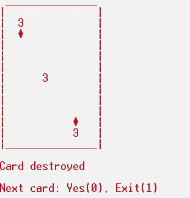

# Random card cpp

## Description

Random card cpp is an object oriented console app written in C++ programming language. It shows a random card every time is asked to. Uses the **srand()** function in order to generate random characters and symbols.

## Usage
- Can be directly opened from **card.exe** and raw code is in the **main.cpp**, **Card.cpp** and **Card.h** files.

- Press 0 to get another card or 1 to exit.

## License

[MIT](https://choosealicense.com/licenses/mit/)
